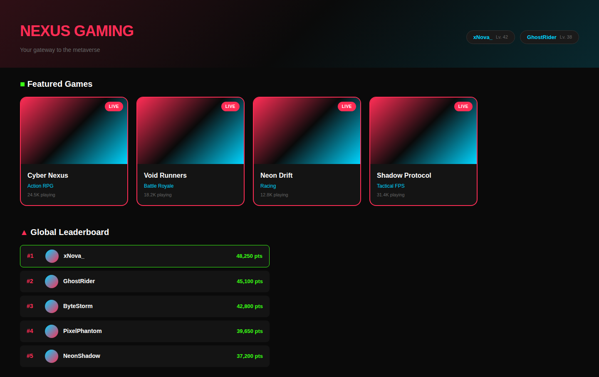
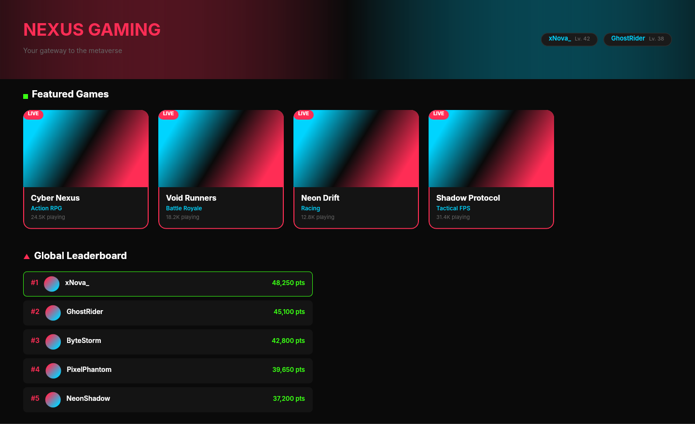

# Dogfooding: Neon Gaming
> Date: 2026-03-16 | Iteration: 4 of 100

## Theme
**Neon Gaming** — Game library with neon gradients, thick strokes, LIVE badges, leaderboard.
DSL features stressed: multi-stop gradients, gradient angles, thick strokes, high cornerRadius, clipContent, 8-digit hex alpha

## Components created
- `GameCard` — Dark card with neon gradient cover, LIVE badge, thick pink border
- `LeaderboardRow` — Rank row with gradient avatar, neon green score, conditional green border
- `UsernameTag` — Pill tag with cyan username and gray level

## Renders

### Browser (React)

### DSL Pipeline

## Comparison

| Area | Match? | Issue | Type | Fixed? |
|---|---|---|---|---|
| Hero gradient | YES | 8-digit hex alpha in gradient stops works | — | — |
| Game cards | YES | Multi-stop neon gradients, thick strokes, cornerRadius 16, clipContent | — | — |
| LIVE badge | PARTIAL | Positioned top-left in DSL vs top-right in browser (no right-anchor in DSL) | DSL limitation | N/A |
| Leaderboard | YES | Gradient avatars, conditional strokes, neon green text all correct | — | — |
| Username tags | YES | Pill shape, stroke, cyan text all render correctly | — | — |

## Pipeline fixes
- None needed

## Known pipeline gaps (not fixed)
- **Right/bottom anchoring**: DSL absolute positioning only supports x/y from top-left. CSS `right: 10px` positioning requires Figma constraints, not available in DSL auto-layout.

## Figma Plugin JSON
Ready-to-import file: [figma-plugin/2026-03-16-neon-gaming-plugin.json](figma-plugin/2026-03-16-neon-gaming-plugin.json)

## Commits
- (see git log)
