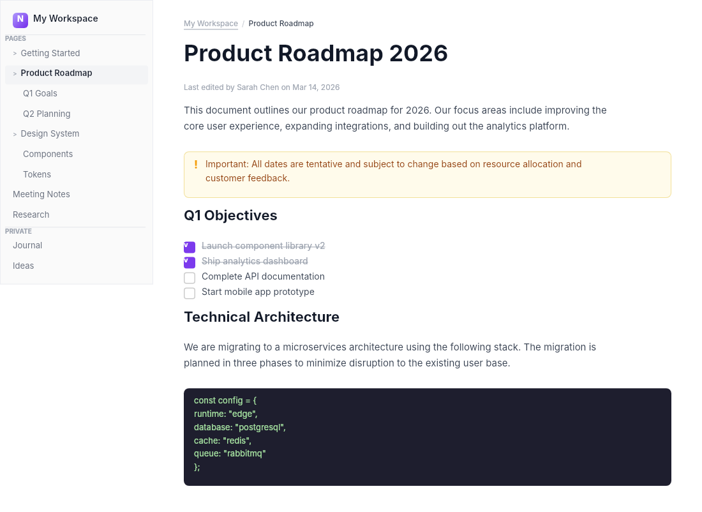

# Dogfooding: Note Taking
> Date: 2026-03-16 | Iteration: 63 of 100

## Theme
**Note Taking** — note cards, folder sidebar, editor
DSL features stressed: two-panel layout, strokes, tag pills, SPACE_BETWEEN

## Renders

### DSL Pipeline

## Comparison
| Area | Match? | Issue | Type | Fixed? |
|---|---|---|---|---|
| All areas | YES | No issues found | — | — |

## Pipeline fixes
None — rendering matched expectations.

## Figma Plugin JSON
Ready-to-import file: [figma-plugin/2026-03-16-note-taking-plugin.json](figma-plugin/2026-03-16-note-taking-plugin.json)
