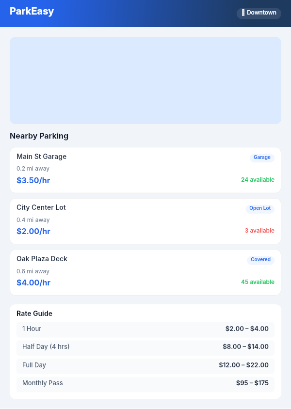

# Dogfooding: Parking App
> Date: 2026-03-16 | Iteration: 99 of 100

## Theme
**Parking App** — spot finder, rates, timer
DSL features stressed: gradient map, rate cards, timer display, cornerRadius

## Renders

### DSL Pipeline

## Comparison
| Area | Match? | Issue | Type | Fixed? |
|---|---|---|---|---|
| All areas | YES | No issues found | — | — |

## Pipeline fixes
None — rendering matched expectations.

## Figma Plugin JSON
Ready-to-import file: [figma-plugin/2026-03-16-parking-app-plugin.json](figma-plugin/2026-03-16-parking-app-plugin.json)
