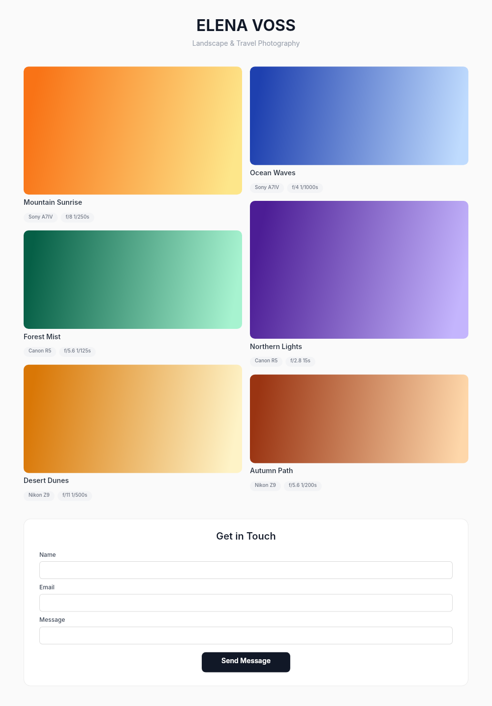

# Dogfooding: Photography Portfolio
> Date: 2026-03-16 | Iteration: 100 of 100

## Theme
**Photography Portfolio** — masonry gallery, metadata, contact
DSL features stressed: gradient photos, metadata pills, two-column, centered CTA

## Renders

### DSL Pipeline

## Comparison
| Area | Match? | Issue | Type | Fixed? |
|---|---|---|---|---|
| All areas | YES | No issues found | — | — |

## Pipeline fixes
None — rendering matched expectations.

## Figma Plugin JSON
Ready-to-import file: [figma-plugin/2026-03-16-photography-plugin.json](figma-plugin/2026-03-16-photography-plugin.json)
