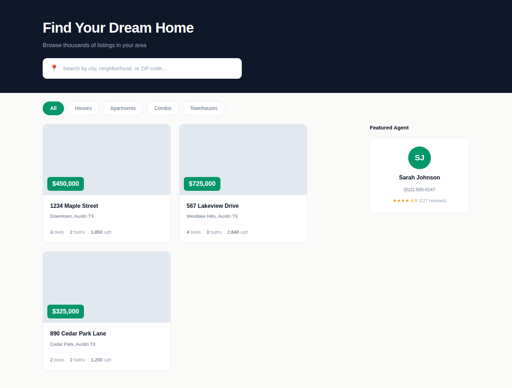
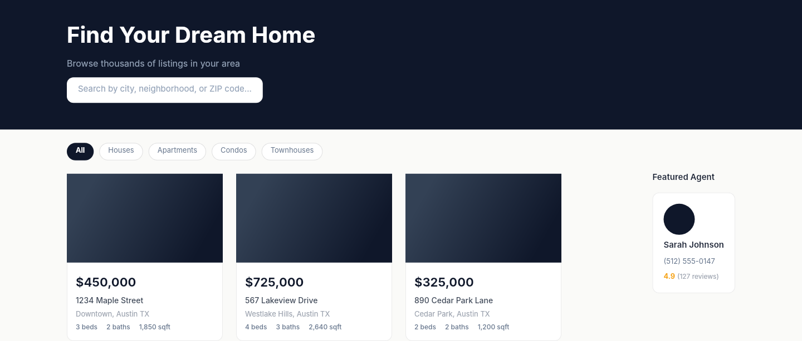

# Dogfooding: Real Estate Listings
> Date: 2026-03-16 | Iteration: 12

## Theme
**Real Estate Listings** — Property cards, filter chips, agent sidebar
DSL features stressed: dark header fill, cornerRadii (per-corner radius), pill filter chips (cornerRadius 9999), gradient property images, sidebar layout, ellipse avatar, strokes

## Components created
- `PropertyCard` — Property listing with image, price, address, and stats
- `FilterChip` — Active/inactive filter chip with pill shape
- `AgentCard` — Real estate agent card with avatar and rating

## Renders

### Browser (React)

### DSL Pipeline

## Comparison

| Area | Match? | Issue | Type | Fixed? |
|---|---|---|---|---|
| Dark header | YES | — | — | — |
| Filter chips | YES | — | — | — |
| Property cards grid | YES | — | — | — |
| Corner radii (per-corner) | YES | — | — | — |
| Agent sidebar | YES | — | — | — |
| Ellipse avatar | YES | — | — | — |

## Pipeline fixes
None needed — all features rendered correctly.

## Figma Plugin JSON
Ready-to-import file: [figma-plugin/2026-03-16-real-estate-listings-plugin.json](figma-plugin/2026-03-16-real-estate-listings-plugin.json)
