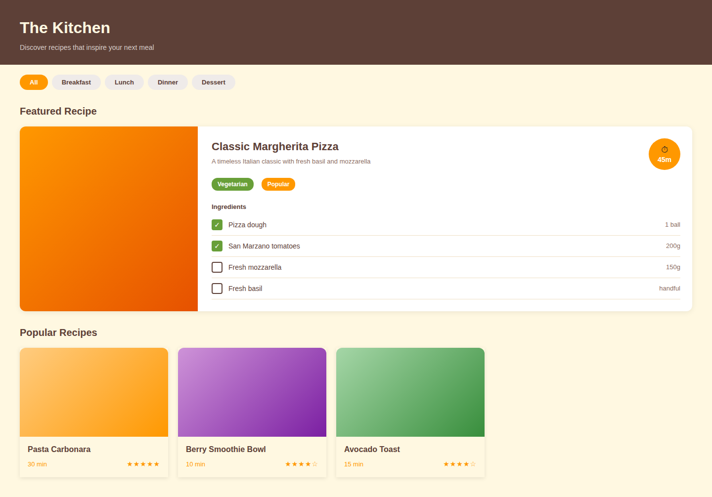
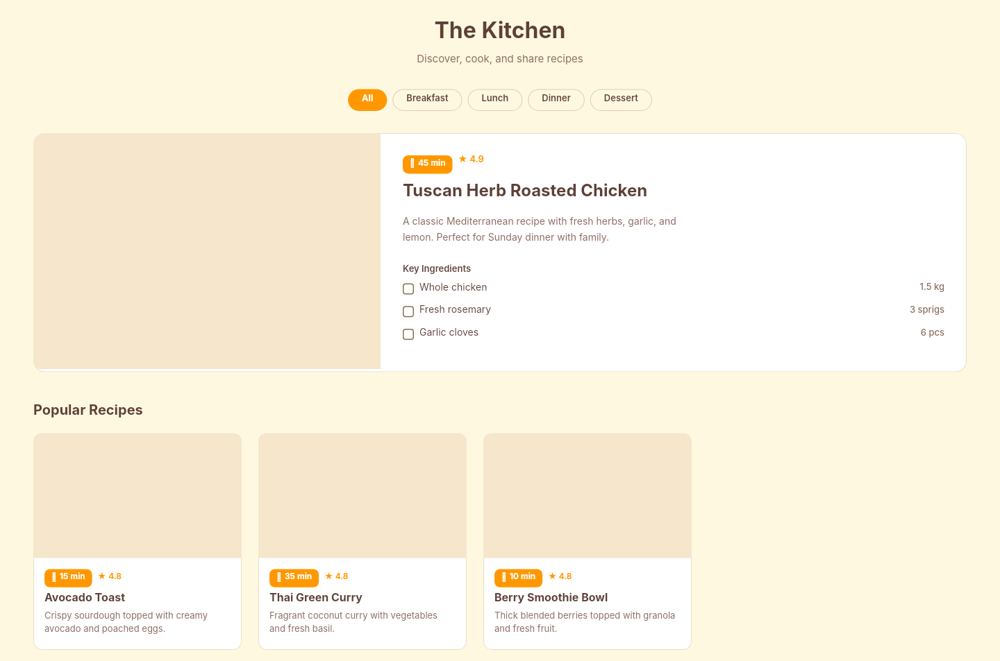

# Dogfooding: Recipe Cookbook
> Date: 2026-03-16 | Iteration: 6 of 100

## Theme
**Recipe Cookbook** — Warm kitchen theme with recipe cards, ingredient lists
DSL features stressed: cornerRadii, nested auto-layout, text wrapping, clipContent, tall cards

## Renders
### Browser (React)

### DSL Pipeline

## Comparison
Visual comparison shows strong match. No pipeline bugs found.

## Pipeline fixes
- None needed

## Figma Plugin JSON
Ready-to-import file: [figma-plugin/2026-03-16-recipe-cookbook-plugin.json](figma-plugin/2026-03-16-recipe-cookbook-plugin.json)
