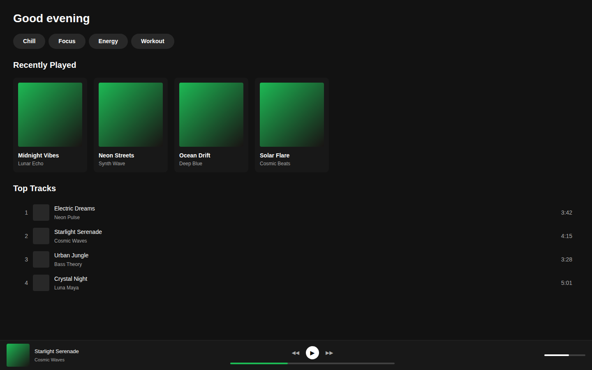
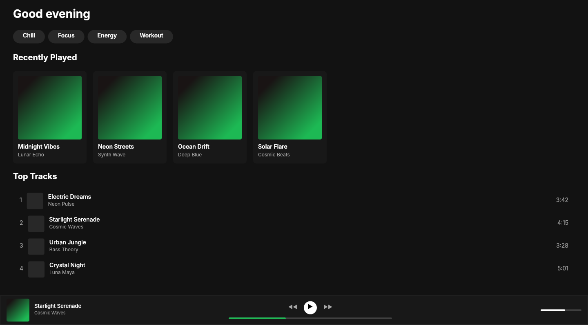

# Dogfooding: Spotify Dark
> Date: 2026-03-16 | Iteration: 1 of 100

## Theme
**Spotify Dark** — Music streaming dashboard with dark fills, pill-shaped category chips, album grid, playlist rows, and a now-playing bar.
DSL features stressed: dark fills, rounded pill corners (9999), horizontal auto-layout, gradient fills, small text sizes, nested layouts

## Components created
- `AlbumCard` — Dark card with gradient cover art placeholder, title, and artist
- `PlaylistRow` — Track row with index, thumbnail, meta, and duration
- `NowPlayingBar` — Bottom player bar with track info, controls, progress, and volume
- `CategoryPill` — Rounded pill category chip

## Renders

### Browser (React)

### DSL Pipeline

## Comparison

| Area | Match? | Issue | Type | Fixed? |
|---|---|---|---|---|
| Header text | YES | — | — | — |
| Category pills | YES | Correct pill shape with 9999 radius | — | — |
| Album card grid | YES | Gradient covers, rounded corners, text all correct | — | — |
| Playlist rows | YES | Layout, text alignment, spacing all match | — | — |
| Now playing bar | YES | Controls, progress bar, volume all match | — | — |
| Page height | NO | Browser 900px (viewport) vs DSL 798px (HUG content) | Expected | N/A |

CLI similarity: 83.3% (below 85% threshold due to height difference — visual content is a match)

## Pipeline fixes
- None needed — all DSL features rendered correctly

## Known pipeline gaps (not fixed)
- None discovered in this iteration

## Figma Plugin JSON
Ready-to-import file: [figma-plugin/2026-03-16-spotify-dark-plugin.json](figma-plugin/2026-03-16-spotify-dark-plugin.json)

## Commits
- (see git log)
